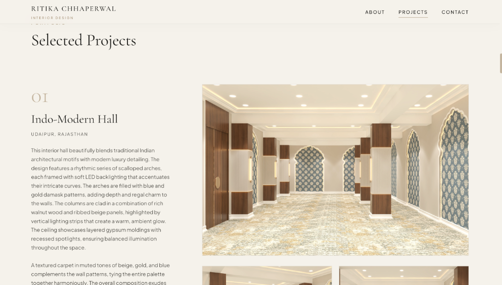

# Ritika Chhaperwal — Interior Design Portfolio
> **Interior Designer & Visual Storyteller** based in Rajasthan, India.

A premium, responsive, single-page architectural portfolio website built using semantic HTML5, modern vanilla CSS (using dynamic custom properties and grid layouts), and lightweight vanilla JavaScript.

---

## 📸 Preview Gallery

Once you capture screenshots of your website, replace these placeholder images to showcase your work:

### Desktop Homepage View


### Projects Showcase View


---

## 📂 Featured Projects

### 01. Indo-Modern Hall (Udaipur, Rajasthan)
A beautiful blend of traditional Indian architectural motifs with modern luxury detailing. Features rhythmic scalloped arches, LED backlighting, walnut columns, and layered gypsum moldings.

### 02. Neo-Classical Villa (Udaipur, Rajasthan)
Timeless grandeur and refined symmetry. Includes double-height columns, ornate wrought-iron balconies, cornices, manicured landscape framing, and opulent portico lighting.

### 03. Contemporary Bathroom (Udaipur, Rajasthan)
A serene spa-like environment blending organic stone pedestal basins and backlit textures with minimalist brass fixtures.

### 04. Contemporary Dental Clinic (Udaipur, Rajasthan)
Thoughtful spatial planning focusing on hygiene, patient privacy, and ergonomics. Uses minimal lines and zoning layouts for clinical efficiency.

### 05. Kitchen (Jaipur, Rajasthan)
A contemporary U-shaped layout showcasing handle-less glossy white/beige cabinetry, under-cabinet workflow lighting, and built-in appliance integration.

---

## 🛠️ Skills & Technologies

- **Software:** AutoCAD, SketchUp, V-Ray, Photoshop, Lumion, MS-Office
- **Analogue:** Concept Development, Spatial Planning, Detail Detailing, Presentation, Team Collaboration, Time Management
- **Languages:** English, Hindi

---

## 🚀 How to Run Locally

You can launch a local web server to review the animations, lightbox gallery, and responsive design in your browser.

1. **Clone the repository:**
   ```bash
   git clone https://github.com/worknabhishek/interior-design-portfolio.git
   cd interior-design-portfolio
   ```

2. **Start a local development server:**
   - Using Python 3:
     ```bash
     python3 -m http.server 8000
     ```
   - Or using Node.js (`http-server`):
     ```bash
     npx http-server -p 8000
     ```

3. **Open the site:**
   Navigate to [http://localhost:8000](http://localhost:8000) in your web browser.

---

## 🖼️ Capturing & Adding Your Screenshots

To add the website previews shown above:
1. Open the website locally at [http://localhost:8000](http://localhost:8000).
2. Take a screenshot of the top **Hero / Cover** section and save it as `hero_desktop.png`.
3. Scroll to the **Selected Projects** grid, take a screenshot, and save it as `projects_desktop.png`.
4. Move both files into the `screenshots/` directory of your local repository.
5. Commit and push the updates:
   ```bash
   git add screenshots/
   git commit -m "Add website preview screenshots"
   git push origin main
   ```
